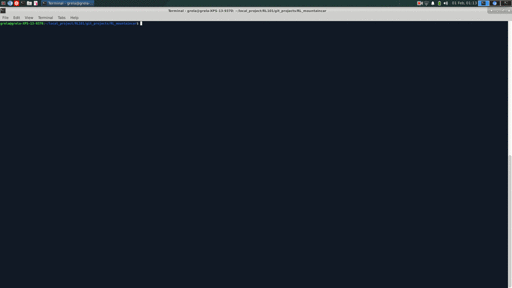

# RL_mountaincar
User friendly code to see Reinforcement Learning algorithm at work in a Mountain Car environment.
Mountain Car environment is based on the Example 9.2 from the book "Reinforcement Learning:an introduction" by Sutton and Barto.
It is an example of a RL environment with continuous state space where approximating the Q-value function is needed.

## How to start?
To start the simulation simply run
```
python mountain_car.py
```
which runs a pre-trained model on a randomly chosen initial states.
<p align="center">
  
</p>

### What is going on?
In the top left corner we sketch the environment - a hill with two barriers and the dot representing the car-agent. The task is to reach the top of the hill on the right given some initial position and velocity.
Car-agent can go forward, backward or do nothing; its motion is based on a simple physics model.
The difficulty is in the cars inability to simply go over the hill by just pushing the pedal.
Instead, in order to escape the valley and complete the task, the agent must learn a sequence of momentum storing phases.

Three remaining plots give some diagnostics:
- bottom left plot is a phase space diagram with position (x-axis) and velocity (y-axis) of the car-agent.
Dashed grid is the approximation grid used to evaluate the Q function.
- bottom right plot is the normalized weight matrix approximating the Q function. We can track its modifications during training.
- top right plot gives the timesteps of each succesful escape from the valley. Mean and standard deviation is also calculated.

Below we see how a typical training looks:
<p align="center">
  
</p>

## Options
All available options are found through
```
python mountain_car.py --help
```

## Algorithm

SARSA algorithm with a linear approximation of the Q function due to continuous state space.

## Examples
In the **/examples** directory working examples are provided.

- *back-and-forth*

A simulation shows how a pre-trained model work when the starting state is most unfortunate - the car-agent is at the bottom of the valley with no initial velocity.


```
./back-and-forth.sh
```
